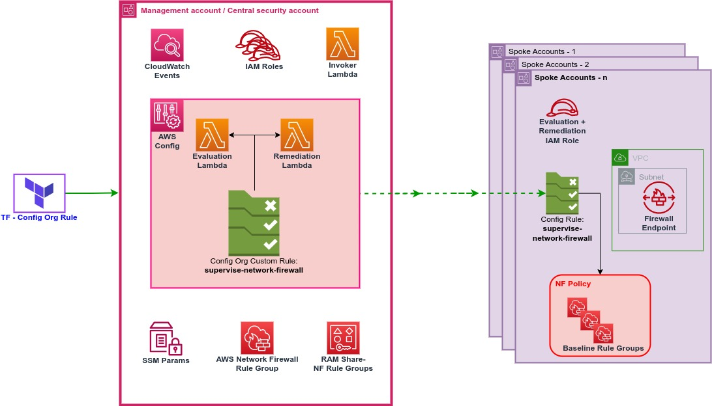

<!-- BEGIN_TF_DOCS -->
# AWS Network Firewall Supervisor - Terraform Sample

This repository contains terraform code to deploy the sample AWS Network Firewall Supervisor architecture. This solution can be used to **monitor** and **remediate** the compliance of **decentralized** AWS Network Firewalls across an entire AWS Organization. 

Central security/network teams gain the ability to define **baseline** stateful or stateless rule groups that will be enforced on decentralized firewalls that are deployed in application accounts. With this tool, a safety net can be applied to firewalls in spoke accounts while providing flexibility for the application teams to add their own firewall rule groups on top. 

This example will show you how to apply baseline rule groups to a firewall in any account within your AWS Organization. The resources deployed and the architectural pattern they follow is purely for demonstration/testing purposes.

## Prerequisites
- AWS Organization with at least one non-root account
- AWS Config enabled across your Organization
- AWS Resource Access Manager (RAM) enabled across your Organization
- AWS account (AWS Organizations management account) with an IAM user with the appropriate permissions
- A non-root AWS account with an AWS Network Firewall policy deployed
- Terraform installed

## Target Architecture



In the architecture above, the **central security account** is displayed alongside an example of a **target account** in which an AWS Network Firewall policy will be managed.

The management account is the central location in which Network Firewall rule groups will be defined and all other accounts are managed from. It will contain the following resources:

- **AWS Config**: used to deploy an Organizational Config rule to all accounts in the organization
- **AWS Network Firewall**: centrally defined rule groups are deployed here before being shared
- **AWS Resource Access Manager**: shares rule groups as needed to each OU
- **CloudWatch Event rule + Invoker Lambda function**: triggers the AWS Config rule once a rule group is shared
- **Evaluation Lambda function**: checks the compliance of firewalls in each account, reports the compliance status back to Config, and triggers the remediation Lambda function
- **Remediation Lambda function**: modifies the firewalls in each account to add the required baseline rule groups
- **SSM Parameter**: containing a mapping of OUs to the rule groups that need to be applied there


## Evaluation
This solution evaluates the following AWS Network Firewall policy configurations in all accounts within the Organization:
- Whether or not baseline rule groups are applied in the required accounts
- Priority of each rule group
- (Optional) Evaluation order of the policy (i.e. default or strict ordering)

Evaluations of firewall policies occur on the following basis:
- **Triggered evaluation**: every time a firewall policy is modified in the AWS Organization
- **Triggered evaluation**: upon creation of baseline rule group

## Remediation
Once the evaluation has completed, AWS Config then (optionally) remediates the non-compliant firewalls. When defining the baseline rule groups, there are two configurable options that control what the tool remediates:
- **Baseline plus**:
  - *"true"*:
    - Add baseline rule groups to all firewall policies in target account
    - If strict order is enabled, reprioritise rule groups to ensure baseline rule groups are always evaluated first

  - *"false"*:
    - Add baseline rule groups to all firewall policies in target account
    - Remove all non-baseline rule groups from firewall policies in target account

- **Strict order**
  - *"true"*:
    - For non-compliant policies, create a new firewall policy with strict ordering enabled (with otherwise the same configuration as the non-compliant policy)
    - Associate the new firewall policy with any firewalls that were using the non-compliant policy
    - Delete the non-compliant firewall policy

  - *"false"*:
    - No action taken

***Note***: Enforcing strict ordering will cause the deletion of the non-compliant policy and replacement. All existing stateful rules **will be removed** on first run, as they do not have an associated priority.


## Usage and deployment
**1. Clone the repository**
<br/><br/>

**2. Deploy the IAM role provided in the "/spoke_role" folder to the target account in which the firewall is deployed**  
&emsp;This role gives the evaluation and remediation Lambda functions permissions to read and modify AWS Network Firewall resources.

&emsp;***Note***: In a large AWS Organization, the IAM role deployed to the target account would ideally be deployed during account creation, and a Service Control Policy (SCP) deployed to prevent its modification.
<br/><br/>

**3. (Optional) If not already present, deploy an AWS Network Firewall policy to the target account**
<br/><br/>

**3. Modify the main.tf file to provide the parameter values**  
&emsp;Required input values are:
  - remediate: "true" or "false" (whether or not to enable automated remediation)
  - cross_account_role_name: the name of the IAM role deployed into each target account
<br/><br/>

**4. Define the baseline stateful or stateless rule groups in baseline_rule_groups.tf. The documentation on how to define a rule group in terraform can be found [here](https://registry.terraform.io/providers/hashicorp/aws/latest/docs/resources/networkfirewall_rule_group).**
<br/><br/>

**5. Share the baseline rule groups to your AWS Organization in baseline_rule_groups.tf**  
&emsp;Example:
```
resource "aws_ram_resource_association" "stateful_rule_group_assoc" {
  resource_arn       = aws_networkfirewall_rule_group.deny_all.arn
  resource_share_arn = aws_ram_resource_share.firewall_share.arn
}
```
<br/><br/>
**6. Define which OUs and accounts the baseline rule groups should be applied to in the mappings.tf file**  
&emsp;There are several configuration options available when defining the rule group mapping. The expected format of this mapping is as follows:
<pre>
<b>&lt;Target OU path&gt;</b> {
    <b>&lt;Target Account Id&gt; <span style="color:red">|</span> "all_accounts"</b> {
        <b>baseline_plus</b> = "true" <b><span style="color:red">|</span></b> "false"
        <b>strict_order</b> = "true" <b><span style="color:red">|</span></b> "false"
        <b>Stateful Rule Groups</b> = { &lt;rule group ARN&gt; = &lt;priority&gt; } <b><span style="color:red">|</span></b> [ &lt;rule group ARN&gt; ]
        <b>Stateless Rule Groups</b> = { &lt;rule group ARN&gt; = &lt;priority&gt; }
    }
}
</pre>

&emsp;As demonstrated above, if the policy has **strict ordering** enabled, stateful rule groups must be defined as a **dictionary** with a priority assigned `{ <rule group ARN> = <priority> }`. If the policy has **default ordering** enabled, stateful rule groups must be defined simply as a **list** of ARNs `[ <rule group ARN> ]`.

&emsp;In the example below:
  - The Organizational Units (OUs) /Root/qa and /Root/prod have different baselines applied
  - In **/Root/qa**, baselines are applied to all accounts
  - In **/Root/production**, baselines are applied to all accounts **except** account 12345678911 (this has a different baseline to the rest)
  - In the account **12345678911**, strict ordering is not enforced and no stateless rule groups are applied

&emsp;Example:
```
locals {
  rule_group_mappings = {

    "/Root/qa" = {
      "all_accounts" = {
        "baseline_plus" = "true"
        "strict_order"  = "true"
        "STATEFUL" = {
          "${aws_networkfirewall_rule_group.deny_all.arn}" = 20
        },
        "STATELESS" = {
          "${aws_networkfirewall_rule_group.deny_some_tcp.arn}" = 200
        }
      }
    },

    "/Root/production" = {
      "all_accounts" = {
        "baseline_plus" = "true"
        "strict_order"  = "true"
        "STATEFUL" = {
          "${aws_networkfirewall_rule_group.deny_all.arn}" = 20
        },
        "STATELESS" = {
          "${aws_networkfirewall_rule_group.deny_some_tcp.arn}" = 200
        }
      },
      "12345678911" = {
        "baseline_plus" = "true"
        "strict_order"  = "false"
        "STATEFUL" = [
          "${aws_networkfirewall_rule_group.deny_all.arn}"
        ]
      }
    }
  }
}
```
<br/><br/>
**7. Deploy the terraform code to the management account (or delegated Config administrator account)**
<br/><br/>

### You will now see the defined baseline rule groups applied to all AWS Network Firewall policies in the target account!


## Cleanup

Remember to clean up after your work is complete. You can do that by doing `terraform destroy`.

Note that this command will delete all the resources previously created by Terraform.


## Future State and Limitations

This solution has some minor limitations that we are aware of and may be part of the roadmap:
- If an AWS Network Firewall rule group is applied to spoke accounts, it must first be removed from the rule group mapping before it is deleted.
- Currently there is remediation to convert policies from default ordering to strict ordering, but not vice versa.
- With strict ordering, baseline rule groups will be evaluated first by default. Future capabilites may be added to control the order.

------

## Security

See [CONTRIBUTING](CONTRIBUTING.md#security-issue-notifications) for more information.

------

## License

This library is licensed under the MIT-0 License. See the LICENSE file.

------

## Requirements

| Name | Version |
|------|---------|
| <a name="requirement_terraform"></a> [terraform](#requirement\_terraform) | >= 1.3.0 |
| <a name="requirement_aws"></a> [aws](#requirement\_aws) | >= 3.73.0 |

## Providers

| Name | Version |
|------|---------|
| <a name="provider_aws"></a> [aws](#provider\_aws) | 4.53.0 |

## Modules

| Name | Source | Version |
|------|--------|---------|
| <a name="module_nf-supervisor"></a> [nf-supervisor](#module\_nf-supervisor) | ./modules/nf-supervisor | n/a |

## Resources

| Name | Type |
|------|------|
| [aws_config_organization_custom_rule.network_firewall_config_rule](hhttps://registry.terraform.io/providers/hashicorp/aws/latest/docs/resources/config_organization_custom_rule) | resource |
| [module.evaluation_lambda](https://registry.terraform.io/modules/terraform-aws-modules/lambda/aws/latest) | module |
| [module.remediation_lambda](https://registry.terraform.io/modules/terraform-aws-modules/lambda/aws/latest) | module |
| [module.invoker_lambda](https://registry.terraform.io/modules/terraform-aws-modules/lambda/aws/latest) | module |
| [aws_lambda_permission.evaluation_permission](https://registry.terraform.io/providers/hashicorp/aws/latest/docs/resources/lambda_permission) | resource |
| [aws_lambda_permission.evaluation_multiaccount_config_permission](https://registry.terraform.io/providers/hashicorp/aws/latest/docs/resources/lambda_permission) | resource |
| [aws_lambda_permission.remediation_permission](https://registry.terraform.io/providers/hashicorp/aws/latest/docs/resources/lambda_permission) | resource |
| [aws_lambda_permission.invoker_permission](https://registry.terraform.io/providers/hashicorp/aws/latest/docs/resources/lambda_permission) | resource |
| [aws_ram_resource_share.rule_group_share](https://registry.terraform.io/providers/hashicorp/aws/latest/docs/resources/ram_resource_share) | resource |
| [aws_ram_principal_association.org_assoc](https://registry.terraform.io/providers/hashicorp/aws/latest/docs/resources/ram_principal_association) | resource |
| [aws_ram_resource_association.stateful_rule_group_assoc](https://registry.terraform.io/providers/hashicorp/aws/latest/docs/resources/ram_resource_association) | resource |
| [aws_ram_resource_association.stateless_rule_group_assoc](https://registry.terraform.io/providers/hashicorp/aws/latest/docs/resources/ram_resource_association) | resource |
| [aws_iam_role.nf_supervisor_lambda_role](https://registry.terraform.io/providers/hashicorp/aws/latest/docs/resources/iam_role) | resource |
| [aws_iam_role_policy.nf_supervisor_lambda_policy](https://registry.terraform.io/providers/hashicorp/aws/latest/docs/resources/iam_role_policy) | resource |
| [aws_iam_policy_document.nf_supervisor_lambda_trust_policy](https://registry.terraform.io/providers/hashicorp/aws/latest/docs/data-sources/iam_policy_document) | data source |
| [aws_iam_policy_document.nf_supervisor_lambda_policy](https://registry.terraform.io/providers/hashicorp/aws/latest/docs/data-sources/iam_policy_document) | data source |
| [aws_iam_role.invoker_lambda_role](https://registry.terraform.io/providers/hashicorp/aws/latest/docs/resources/iam_role) | resource |
| [aws_iam_role_policy.invoker_lambda_policy](https://registry.terraform.io/providers/hashicorp/aws/latest/docs/resources/iam_role_policy) | resource |
| [aws_iam_policy_document.invoker_lambda_policy](https://registry.terraform.io/providers/hashicorp/aws/latest/docs/data-sources/iam_policy_document) | data source |
| [aws_cloudwatch_event_rule.rule_group_shared_event](https://registry.terraform.io/providers/hashicorp/aws/latest/docs/resources/cloudwatch_event_rule) | resource |
| [aws_cloudwatch_event_target.trigger_evaluation](https://registry.terraform.io/providers/hashicorp/aws/latest/docs/resources/cloudwatch_event_target) | resource |
| [aws_networkfirewall_rule_group.deny_all](https://registry.terraform.io/providers/hashicorp/aws/latest/docs/resources/networkfirewall_rule_group) | resource |
| [aws_networkfirewall_rule_group.deny_some_tcp](https://registry.terraform.io/providers/hashicorp/aws/latest/docs/resources/networkfirewall_rule_group) | resource |
| [aws_ssm_parameter.rule_group_OU_mapping](https://registry.terraform.io/providers/hashicorp/aws/latest/docs/resources/ssm_parameter) | resource |


## Inputs

| Name | Description | Type | Default | Required |
|------|-------------|------|---------|:--------:|
| <a name="remediate"></a> [remediate](#input\_remediate) | Whether or not remediate AWS Network Firewall Policies | `string` | <pre>"true"<br> | yes |
| <a name="cross_account_role_name"></a> [cross_account_role_name](#input\_cross\_account\_role\_name) | Name of cross account IAM role used to evaluate and remediate | `string` | <pre>"nf-supervisor-execution-role"<br> | yes |

<!-- END_TF_DOCS -->